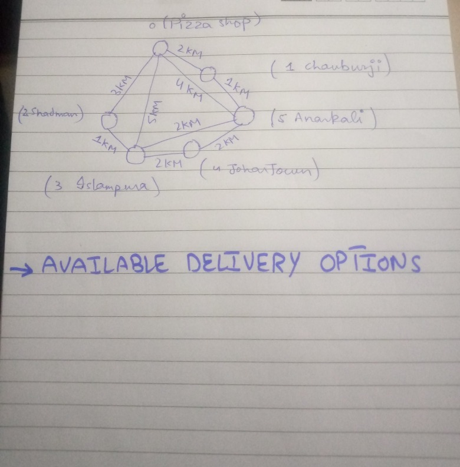

# PIZZA LAB MANAGEMENT SYSTEM

## Data Structures and Algorithm's Project

### SHAHZANEER AHMED
### SP21-BCS-087

### DR. INAYAT UR REHMAN

 **Overview**

> The main idea revolves around a Pizza Shop that deals with three
> different kinds of customers and serves them in different ways. The
> Project is built to assist that small business. It also stores the
> information of the customers served and the total earnings of the
> shop. The waiting customers' info can also be displayed.
>
> Searching for the served Customers can be done. The delivery charges
> are calculated on the basis of the shortest distance on the map and 50 RS_/ per KM is charged as delivery charges.
>
 **Types of Customers**

 1. Walk-In Customers
>
> They will be served on the basis of their age. The older customer will
> be
>
> served first.
>
 2. Home Delivery Customers
>
> They will be served on the basis of LIFO
>
 3. Dine-In Customers
>
> They will be served on the basis of First come and first serve basis.
>
 **Served Customers**
>
> The Customers which are served are recorded in the System to keep the
> record of the served Customers and their bills so that we may have
> insights into the daily sales of the shop. Its main purpose is to
> check the record of a particular Customer

 **Map for Home Delivery**

 **Implemented Data Structures and Algorithms**

**1. LinkedList**

> The whole implementation of Customer's Enqueue and dequeue is based on
> the LinkedList.
>
**2. Stack**

It is used in placing orders and serving Home Delivery Customers.

**3. Dynamic Queue**

3

> It is used in placing orders and serving Dine-In Customers.

**4. Dynamic Priority Queue**

> It is used in placing orders and serving Walk-In Customers.

**5. Graph (Adjacency List Representation)**

> It is used for the Map for available Delivery options.

 **6. AVL Tree**

> The Served Customers were saved in it for efficient insertion, deletion,
> and searching. The implementation was based upon the
> lexicographical comparison of strings.

 **7. Dijkstra Algorithm**

> It is used to find the shortest possible distance from the Pizza Shop and
> on this basis, the Delivery charges are calculated.
